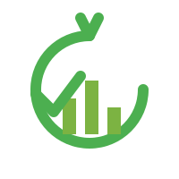

# FoodSavr

  

`FoodSavr` is a mobile application designed to help you reduce food 
waste, save time, and manage your grocery expenses efficiently. By tracking 
inventory and synchronizing with your meal planning, the application ensures you always know 
what you have and what you need.

  

## Key Features

- [x] **Barcode Lookup:** Scan product barcodes to automatically fetch product details.
- [x] **Inventory Overview:** A clear and concise overview of all your food supplies.
- [x] **Insightful Dashboard:** Get an at-a-glance overview of your food consumption habits and waste reduction stats.
- [x] **Third party integration (Rema Æ app):** Connect with supported grocery stores for easier purchase history import.
- [x] **Shopping List view:** A basic, manual list for groceries to buy and check off, without direct connection to inventory levels.
- [x] **Customizable Settings:** Language, themes, and app behavior.
- [ ] **Receipt Scanning:** Quickly add items to your inventory by scanning receipts.
- [ ] **Expiration Tracking:** Get timely reminders before your food expires to reduce waste.
- [ ] **Consumption Analysis:** The app learns your consumption patterns to better predict when you'll run out of items.
- [ ] **Meal Planning Sync:** Integrate your inventory with meal plans to create your shoppinglist.

## Tech Stack

- **Framework:** [Flutter](https://flutter.dev/)
- **Language:** [Dart](https://dart.dev/)
- **Database:** [Cloud Firestore](https://firebase.google.com/docs/firestore)
- **Authentication:** [Firebase Authentication](https://firebase.google.com/docs/auth)

## Getting Started

Want to tinker with the code? Check out the **[Getting Started guide](./doc/getting_started.md)** for instructions on how to set up your dev environment.

## How to Contribute

Got an idea or want to fix something? Awesome! We have a few guidelines for contributing that are pretty different from most projects, especially regarding AI-assisted code.

Please check out our **[CONTRIBUTING.md](./.github/CONTRIBUTING.md)** for the full scoop on how to get started.

## License

This project is licensed under the **Creative Commons Attribution-NonCommercial-ShareAlike 4.0 International License**. Peep the `LICENSE` file for the legal details.

This basically means you can share and adapt it for non-commercial use, as long as you give credit and use the same license.

---

For a complete overview of all project documentation, start with the [Documentation Introduction](./doc/introduction.md).
