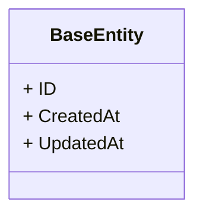
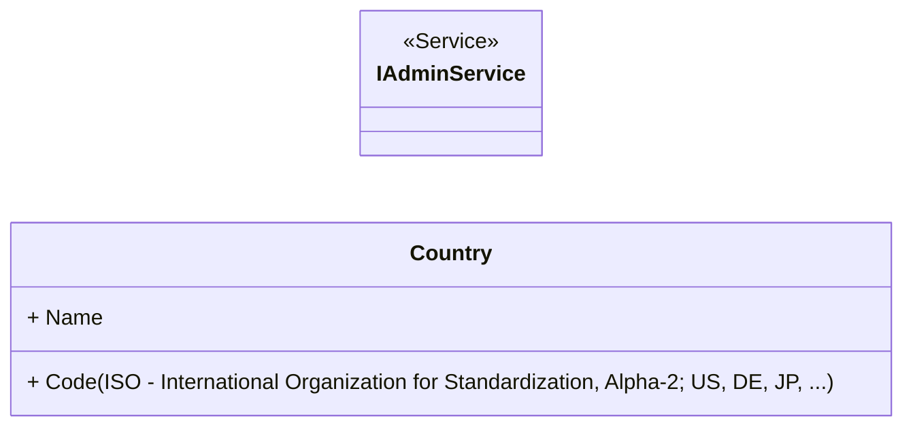
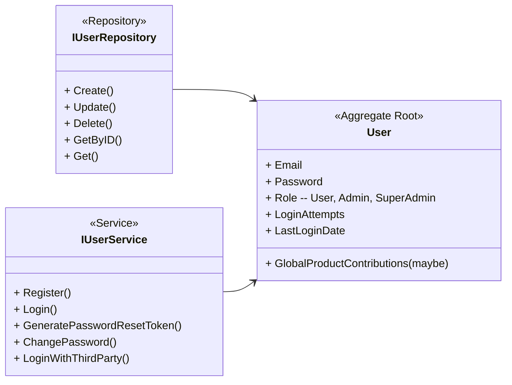
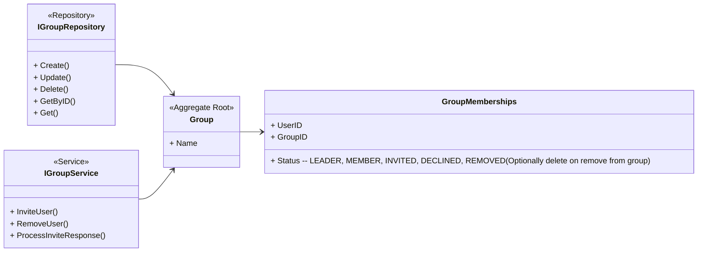
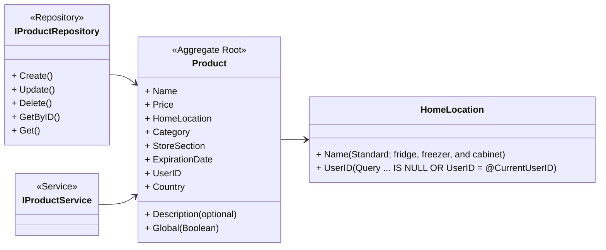
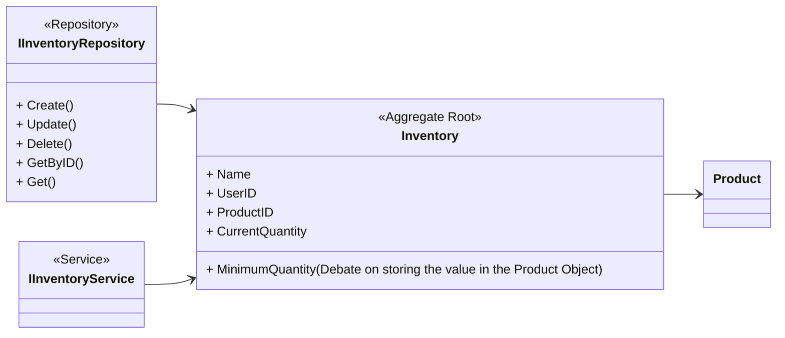
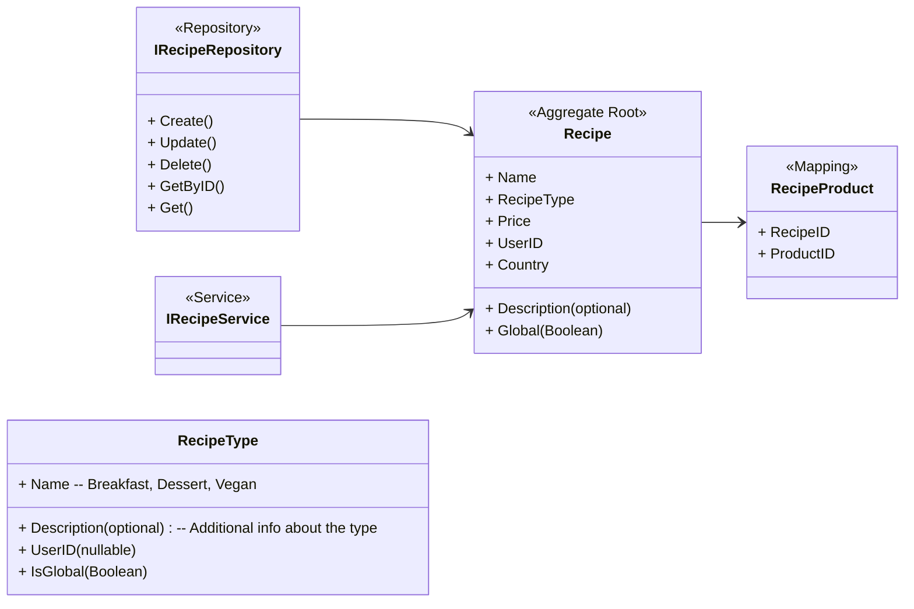
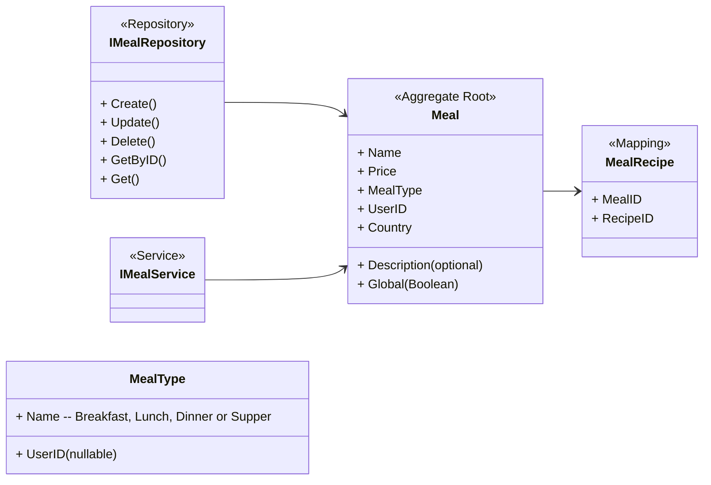
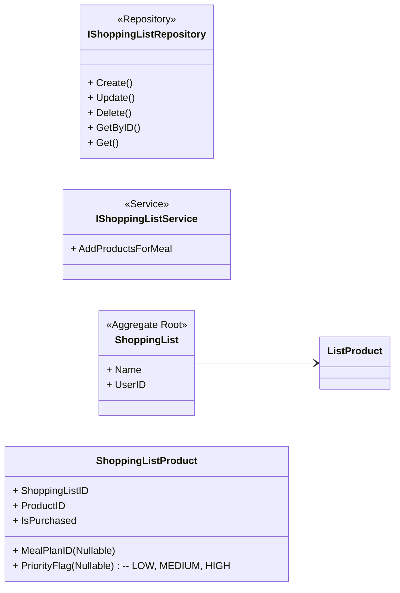
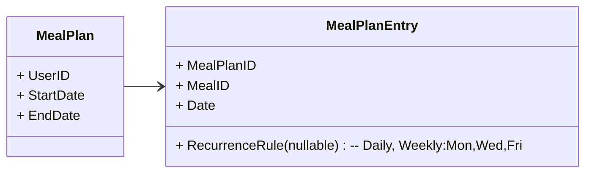

# Relations between modules and contexts

## Flow chart

Use something else than mermaid - maybe figma or draw.io

## Contexts

Keeping the front- and backend modular forces a structured and clean implementation, acheived by using a gRPC API.

Entities in the database should inherite from the BaseEntity:



### Future enhancements

- Consider caching frequently accessed mappings, e.g., meals per user or products per recipe, to reduce query load.
- Nutrient tracking per product, recipe, and meal.
- Predictive budgeting and inventory forecasting.
- Multi-language support and measurement unit conversions.
- Meal plan recurrence and template saving.
- Integration with external APIs for global product lists or dietary guidelines.
- User notifications/reminders for meal plans or expiring inventory.

### Admin

The first user is the super admin (UserID is 1), they can manage users, groups, countries, locations and the global products, recipes and meals lists. The admin decides if a product is added to the global list, optionally can a democratic rule of voting for new products and if it receives more up votes than down votes is it added to the list.

To be secure and safe should all of these actions go through an AdminService - explicitly constructing a workflow for admins to prevent complex/cluttered logic.

Move all the methods meant for admin to this context in service/repository to isolate logic inside of the context.



### User

They can log in (authenticate) and out, update their profile, create entities (product, recipe or meal) from scratch and contribute to the global lists.
A user can delete their account (CASCADE affect on the database) join/leave groups, manage their shoppinglist, recipes, mealplan and follow a budget.

These are some of the core functionalities of the application ...

- The state is peserved when leaving and joining groups
    - Users can be annoyed if a group member leaves and they loose certain meals so this state should be explicit in the UI
    - A user should be allowed to add anothers users meal or product to their favs (private storage - copy-on-add)



### Group

The group context connect the data between users, allowing them to view each others data. (This state will be clearly stated in the UI)
Users can create a group and send invite links to other users. The other users can respond to the email by following a link with unique ID and answer yes or no.

- A group share everything by using Group Memberships entries as a query filter (the group IDs).
    - Should there be a static list of groups (IDs) user is a member of or should there always be a query for finding the group memberships?



### Global list

This context might be removed, but I need a way to allow voting for new products, recipes and meals for a democratic process to add new entities to the global list.


### Product

Products with the same name should be separated if the expiration date differ
    - Is possible to store mapping table for this ??

HomeLocation table
- Designed for standard locations
- Supports custom ones made by the user
- Name can be the primary key to enforce uniqueness

Future support
- Store nutrients
- Multi-country if a meal or recipe is available in several countries. Current single-country design may limit scalability.
    - Consider mapping table EntityCountry for many-to-many relationships.


### Inventory

#### Events

- MissingProduct
    - To support defining a base inventory state to avoid manual tracking
    - Automatically add missing items to the shoppinglist



### Recipes



### Meals

Support user defined meals types ???



### Shopping list

Suggest products given trends like Consider predictive lists based on inventory trends.

The priority flag is there to inform the user of critical products given the current inventory
    - These can be set automatically given the base inventory standard set by the user



### Meal plan

Follow the Gregorian calendar
Store dates in UTC (convert to local time on display)

Weekly plan; "In some countries, the week starts on Sunday (US) and in others on Monday (Europe)" -- chatgpt

#### TODOs

- Meal plan should be synchronized with the shopping list context - a meal added to the plan should translate to products added to the shoppinglist
    - Should support a few feature of reverting this as well, the meal is removed (the previous added items to the shoppinglist should be removed)
- A meal plan should be able to be constructed with saved templates - Add weekly saved mealplan (so essentially store partial meal plans)

#### Events

- MealAddedToPlan



### Budget

This context should provide services for users to view their statics (structured data)
<!-- ```mermaid -->
<!-- classDiagram -->
<!--     direction LR -->
<!---->
<!--     class IBudgetService { -->
<!---->
<!--     } -->
<!-- ``` -->

