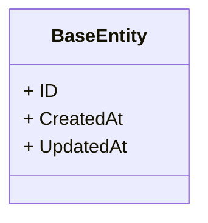
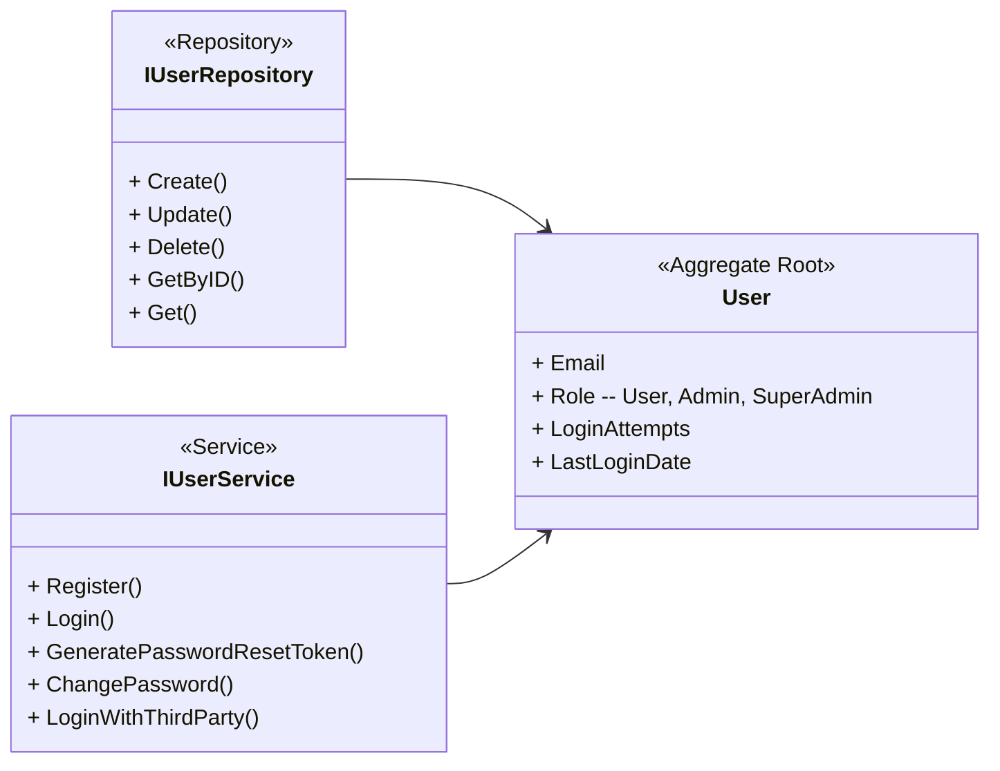
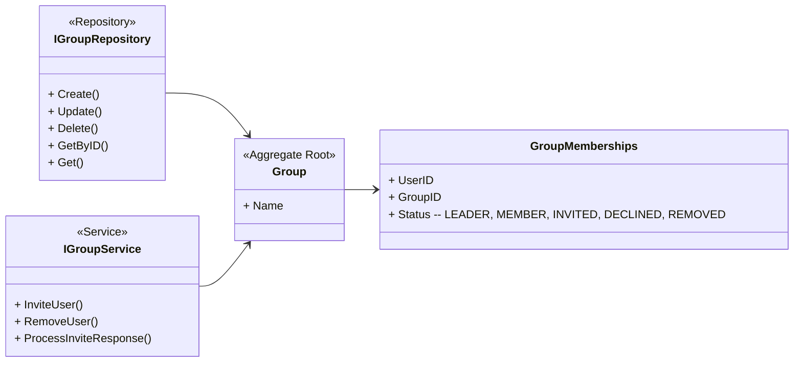
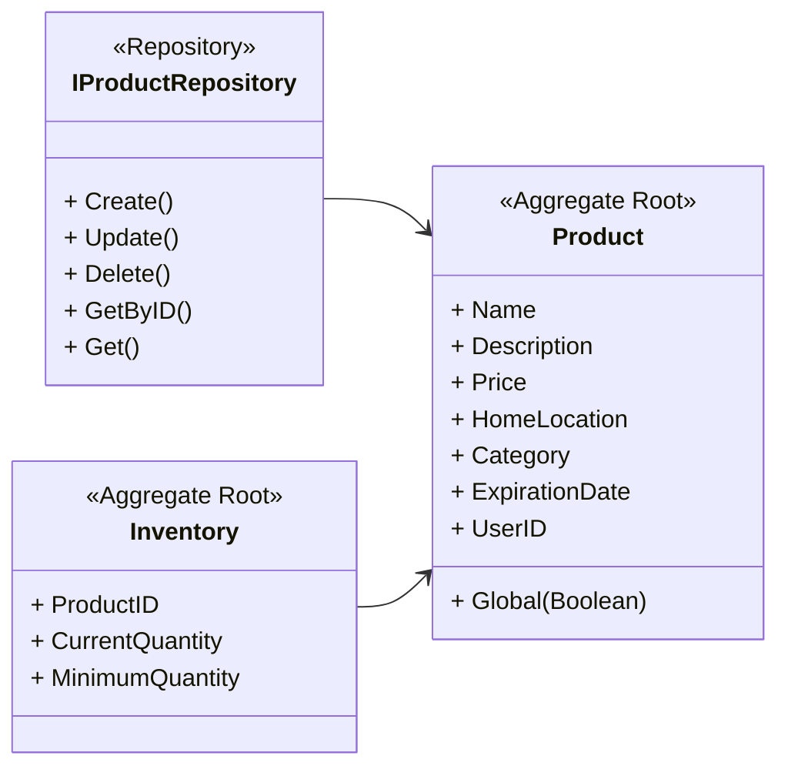
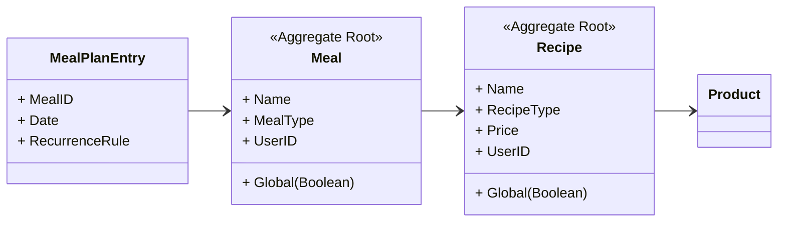
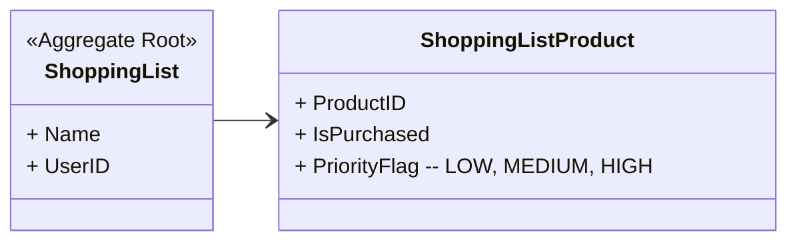

# Module and context relations

This document describes the relationships between the different domains and contexts within `foodsavr`.
It defines how data flows between components and establishes the core data models used across the application.

## Domain architecture

`foodsavr` uses a domain-driven approach to maintain a structured and clean implementation.
Each context represents a specific area of functionality within the application.

All primary entities in the database inherit from a common `BaseEntity`:

## Core contexts

The following sections define the primary contexts and their respective data models.

### Administration

The administration context governs system-wide data and user management. Use the 
`AdminService` to perform administrative actions and maintain global lists.

- **SuperAdmin:** The primary administrator responsible for managing users, groups, and system settings.
- **Admin:** Handles the moderation of global product, recipe, and meal lists.
- **Democratic curation:** Implement a voting system where you can propose new global items, which are added to the official list based on community feedback.

### User management

The user context handles authentication, profile management, and personal data ownership.

- **Authentication:** Support standard credentials and third-party logins.
- **Data ownership:** Maintain personal copies of shared items (copy-on-add) to ensure your data remains accessible even if a group is disbanded.

### Groups and collaboration

The group context enables data sharing and coordination among multiple users.

- **Sharing:** Groups share data by filtering queries through group membership IDs.
- **Invitations:** Create groups and invite others via email. Responses are processed through unique invitation links.

### Products and inventory

The products and inventory contexts track the food items you own and where they 
are stored.

- **Storage locations:** Categorize items by location (fridge, freezer, or cabinet).
- **Inventory events:** Automatically track missing products to populate shopping lists.

### Recipes and meals

Manage your cooking repertoire through recipes and grouped meal plans.

- **Recipes:** Store ingredients and instructions.
- **Meals:** Group recipes together for scheduling.
- **Meal plans:** Synchronize meals with the Gregorian calendar and link them to the shopping list context.

### Shopping lists

The shopping list context manages items to be purchased, informed by your current inventory and upcoming meal plans.

- **Priority:** Flag items as high priority based on critical inventory deficits.
- **Auto-fulfillment:** Mark items as purchased to automatically update your inventory records.

## Future enhancements

Consider the following planned improvements to the data model:

- **Nutrient tracking:** Support per-product and per-meal macro tracking.
- **Predictive budgeting:** Implement inventory forecasting based on 
  historical usage.
- **Measurement conversion:** Provide automatic unit conversions for international recipes.
- **Templates:** Allow you to save and reuse partial meal plans as templates.
