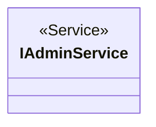
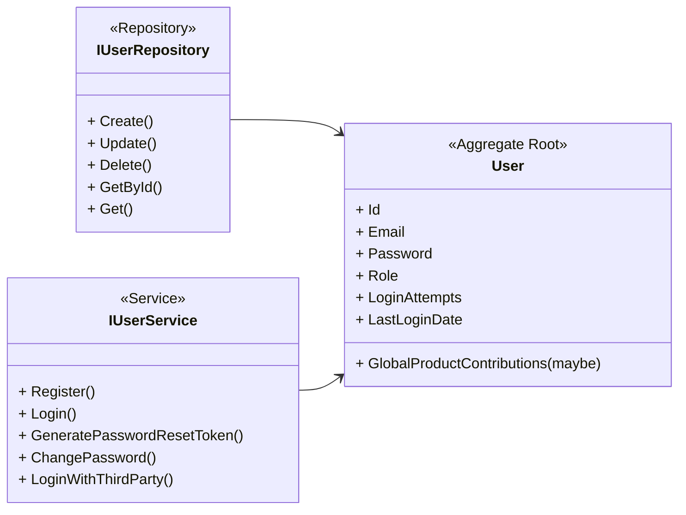
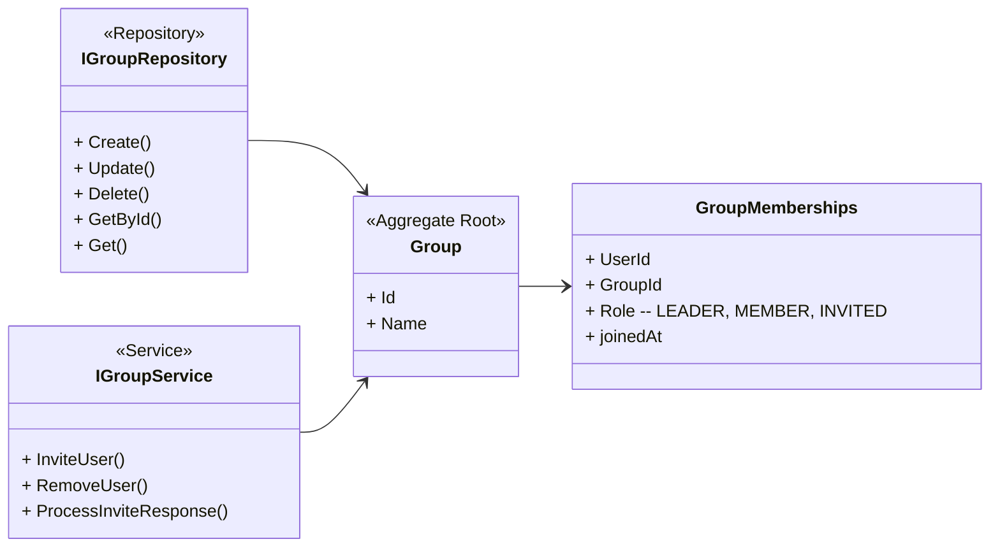

# Relations between modules and contexts

## Flow chart

Use something else than mermaid - maybe figma or draw.io

## Contexts

Keeping the backend modular forces a structured and clean implementation.

### Admin

The first user is the admin (UserID is 1), they can manage users, groups and the global products list. The admin decides if a product is added to the global list, optionally can a democratic rule of voting for new products and if it receives more up votes than down votes is it added to the list.

To be secure and safe should all of these actions go through an AdminService - explicitly constructing a workflow for admins to prevent complex/cluttered logic.

Move all the methods meant for admin to this context in service/repository to isolate logic inside of the context.

### User

They can login in (authenticate) and out, update their profile, create products from scratch and contribute to the global list.
A user can delete their account (CASCADE affect on the database) join/leave groups, manage their shoppinglist, recipes, mealplan and follow a budget.

These are some of the core functionalities of the application ...

### Group

The group context connect the data between users, allowing them to view each others data. (This state will be clearly stated in the UI)

Users can create a group and send invite links to other users. The other user can respond to the email by following a link with unique ID and answer yes or no.

